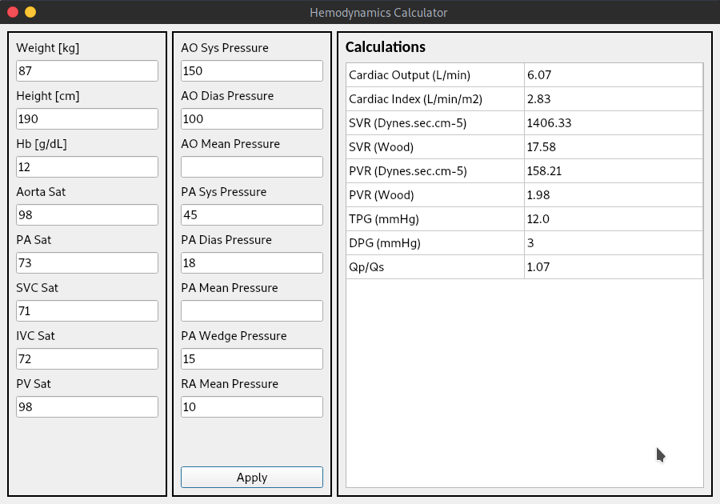
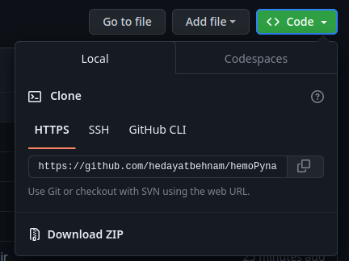

# HemoPynamic App
A single page desktop application for calculation of common hemodynamic equations.

  

## How to use
You can clone repo by github CLI: \n\n
`git clone https://github.com/hedayatbehnam/hemoPynamic`    
or using website link to download **zip** folder.    
  
  

If you are in linux, you should use `unzip` command in terminal.  
___
  
Then install dependencies:    
`pip install -r requirements.txt`    

Entrypoint to the app is `entry.py` file:    

`python entry.py`    
